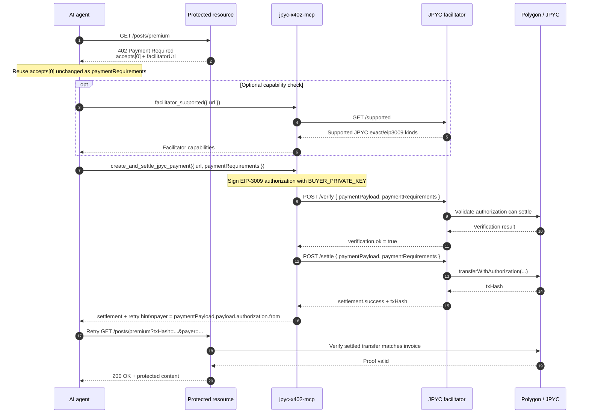

[](https://github.com/jnmarti/jpyc-x402/actions/workflows/test.yml)

# JPYC x402 Facilitator

x402 support for payments with JPYC. It offers a 402x-compatible facilitator that performs payments with JPYC on Polygon, and an MCP server for accessing 402-protected information on the web. Useful for developing and consuming paid content by Japanese merchants for AI agents and humans alike.

The repository also contains some example applications to help developers create agentic workflows that use JPYC.

This project is in no way affiliated with JPYC株式会社. 

## Packages

- `jpyc-x402-facilitator`: host a JPYC facilitator and expose `/supported`, `/verify`, and `/settle`
- `jpyc-x402-client`: sign JPYC EIP-3009 payloads and call facilitator endpoints
- `jpyc-x402-shared`: shared config, amount helpers, EIP-3009 typed-data helpers, and JPYC `exact` payment requirements
- `jpyc-x402-mcp`: MCP server for agents that need to sign and settle through a JPYC facilitator

## Installation

```bash
npm install
```

Or install the workspace packages you need:

```bash
npm install jpyc-x402-facilitator
npm install jpyc-x402-client
npm install jpyc-x402-shared
npm install jpyc-x402-mcp
```

## Quick Start: Host A Facilitator

```js
import "dotenv/config";
import express from "express";

import {
  createJpycExactPaymentRequirements,
  createJpycFacilitatorRouter,
} from "jpyc-x402-facilitator";
import { encodeTokenAmount, resolveJpycConfig } from "jpyc-x402-shared";

const app = express();
const config = resolveJpycConfig({ env: process.env.JPYC_ENV ?? "mainnet" });

app.use("/facilitator", createJpycFacilitatorRouter({
  config,
  privateKey: process.env.FACILITATOR_PRIVATE_KEY,
}));

app.get("/requirements/premium-post", (_req, res) => {
  res.json({
    paymentRequirements: createJpycExactPaymentRequirements({
      config,
      amount: encodeTokenAmount("10", config.decimals),
      payTo: process.env.SELLER_ADDRESS,
      resource: "/posts/premium",
      description: "Premium post",
    }),
  });
});

app.listen(8402);
```

What this gives you:

- `GET /facilitator/supported`
- `POST /facilitator/verify`
- `POST /facilitator/settle`
- a reusable JPYC `exact` payment requirement object for your own x402 flow

## Quick Start: Sign And Settle A Payment

```js
import "dotenv/config";

import {
  createAndSettleJpycPayment,
  createViemAuthorizationSigner,
} from "jpyc-x402-client";

const signer = createViemAuthorizationSigner({
  privateKey: process.env.BUYER_PRIVATE_KEY,
});

const paymentRequirements = {
  scheme: "exact",
  network: "eip155:137",
  maxAmountRequired: "10000000000000000000",
  payTo: process.env.SELLER_ADDRESS,
  asset: process.env.JPYC_TOKEN_ADDRESS,
  resource: "/posts/premium",
  extra: {
    assetTransferMethod: "eip3009",
    name: "JPY Coin",
    version: "1",
  },
};

const result = await createAndSettleJpycPayment(
  "http://127.0.0.1:8402/facilitator",
  paymentRequirements,
  signer,
);

console.log(result.verification.body);
console.log(result.settlement.body);
```

The first argument is the facilitator base URL. Pass `http://127.0.0.1:8402/facilitator`, not
`http://127.0.0.1:8402/facilitator/verify` or `http://127.0.0.1:8402/facilitator/settle`.

## MCP Integration

`jpyc-x402-mcp` exposes facilitator-oriented tools:

- `facilitator_supported`
- `create_jpyc_payment`
- `verify_jpyc_payment`
- `settle_jpyc_payment`
- `create_and_settle_jpyc_payment`

Start it with:

```bash
npm run example:mcp
```

Set `BUYER_PRIVATE_KEY` for the payer wallet before starting the MCP server.

All MCP tools that take `url` expect the facilitator base URL:

- `http://127.0.0.1:4021/facilitator`

Do not pass the final action endpoint:

- not `http://127.0.0.1:4021/facilitator/supported`
- not `http://127.0.0.1:4021/facilitator/verify`
- not `http://127.0.0.1:4021/facilitator/settle`

The MCP server appends the action path internally:

- `facilitator_supported(url)` calls `GET {url}/supported`
- `verify_jpyc_payment(url, ...)` calls `POST {url}/verify`
- `settle_jpyc_payment(url, ...)` calls `POST {url}/settle`
- `create_and_settle_jpyc_payment(url, ...)` calls `POST {url}/verify` and then `POST {url}/settle`

### MCP End-To-End Flow

This is the intended protected-resource flow for agents:

1. Request the protected resource and read the `402 Payment Required` challenge.
2. Use the challenge's `accepts[0]` object as `paymentRequirements`.
3. Create a signed payment payload with `create_jpyc_payment`.
4. Verify or settle it through the facilitator tools.
5. Replay the protected request with whatever proof the resource server expects.



The one-shot MCP tool above is the recommended agent flow. The manual equivalent is
`create_jpyc_payment` -> optional `verify_jpyc_payment` -> `settle_jpyc_payment` -> retry the
protected route with the proof format that server expects.

Example using the express demo in this repository:

1. Fetch the protected route:

```bash
curl http://127.0.0.1:4021/posts/premium
```

Expected `402` shape:

```json
{
  "accepts": [
    {
      "scheme": "exact",
      "network": "eip155:80002",
      "maxAmountRequired": "1000000",
      "payTo": "0x1111111111111111111111111111111111111111",
      "asset": "0xe7c3d8c9a439fede00d2600032d5db0be71c3c29",
      "resource": "/posts/premium",
      "description": "Premium post access settled by the JPYC facilitator.",
      "extra": {
        "assetTransferMethod": "eip3009",
        "name": "JPY Coin",
        "version": "1",
        "decimals": 18,
        "symbol": "JPYC"
      }
    }
  ],
  "facilitatorUrl": "/facilitator"
}
```

2. Fetch facilitator capabilities:

```json
{
  "tool": "facilitator_supported",
  "arguments": {
    "url": "http://127.0.0.1:4021/facilitator"
  }
}
```

3. Create a signed EIP-3009 payment:

```json
{
  "tool": "create_jpyc_payment",
  "arguments": {
    "paymentRequirements": {
      "scheme": "exact",
      "network": "eip155:80002",
      "maxAmountRequired": "1000000",
      "payTo": "0x1111111111111111111111111111111111111111",
      "asset": "0xe7c3d8c9a439fede00d2600032d5db0be71c3c29",
      "resource": "/posts/premium",
      "extra": {
        "assetTransferMethod": "eip3009",
        "name": "JPY Coin",
        "version": "1"
      }
    }
  }
}
```

4. Settle the same payload by passing the `paymentPayload` returned by `create_jpyc_payment` directly into `settle_jpyc_payment`:

Optional verification call before settlement:

```json
{
  "tool": "verify_jpyc_payment",
  "arguments": {
    "url": "http://127.0.0.1:4021/facilitator",
    "paymentPayload": {
      "...": "output from create_jpyc_payment"
    }
  }
}
```

```json
{
  "tool": "settle_jpyc_payment",
  "arguments": {
    "url": "http://127.0.0.1:4021/facilitator",
    "paymentPayload": {
      "x402Version": 1,
      "accepted": {
        "scheme": "exact",
        "network": "eip155:80002",
        "maxAmountRequired": "1000000"
      },
      "payload": {
        "authorization": {
          "from": "0x...",
          "to": "0x...",
          "value": "1000000",
          "validAfter": "0",
          "validBefore": "9999999999",
          "nonce": "0x..."
        },
        "signature": "0x..."
      }
    }
  }
}
```

One-shot alternative:

```json
{
  "tool": "create_and_settle_jpyc_payment",
  "arguments": {
    "url": "http://127.0.0.1:4021/facilitator",
    "paymentRequirements": {
      "...": "same accepts[0] object from the 402 challenge"
    }
  }
}
```

5. Replay the protected resource request with the proof expected by the resource server. The express demo expects `txHash` and `payer`:

```bash
curl "http://127.0.0.1:4021/posts/premium?txHash=0xSETTLED_TX_HASH&payer=0xPAYER_ADDRESS"
```

### Payload Shapes

`paymentRequirements` is the payment challenge object for one resource. In this repository it is
the same object returned by a `402` challenge or `/requirements/premium-post`.

Required fields for the JPYC `exact` flow:

- `scheme`
- `network`
- `maxAmountRequired`
- `payTo`
- `asset`
- `resource`
- `extra.assetTransferMethod`

`paymentPayload` is the signed authorization produced by `create_jpyc_payment`. Its top-level shape
is:

```json
{
  "x402Version": 1,
  "accepted": { "...": "paymentRequirements" },
  "payload": {
    "authorization": {
      "from": "0x...",
      "to": "0x...",
      "value": "1000000",
      "validAfter": "0",
      "validBefore": "9999999999",
      "nonce": "0x..."
    },
    "signature": "0x..."
  }
}
```

You can pass the `paymentPayload` returned by `create_jpyc_payment` directly into:

- `verify_jpyc_payment`
- `settle_jpyc_payment`

If you omit `paymentRequirements` in those follow-up calls, the client falls back to
`paymentPayload.accepted`.

## Examples

- Facilitator example server: `npm run example:facilitator`
- Agent payer example: `npm run example:agent`
- MCP example server: `npm run example:mcp`

The facilitator example serves:

- `/facilitator/*` for the facilitator API
- `/requirements/premium-post` for a sample JPYC `exact` requirement payload
- `/posts/premium` for a protected route that returns a `402` challenge before settlement

## Configuration

Common environment variables:

```env
JPYC_ENV=testnet
JPYC_RPC_URL=https://rpc-amoy.polygon.technology
JPYC_TOKEN_ADDRESS=0xe7c3d8c9a439fede00d2600032d5db0be71c3c29
JPYC_CONFIRMATIONS=1
JPYC_INVOICE_TTL_MS=300000
FACILITATOR_PRIVATE_KEY=0xYourFacilitatorPrivateKey
SELLER_ADDRESS=0xYourSellerAddress
BUYER_PRIVATE_KEY=0xYourBuyerPrivateKey
```

Network behavior:

- `JPYC_ENV=testnet` resolves Polygon Amoy
- `JPYC_ENV=mainnet` resolves Polygon mainnet
- `JPYC_RPC_URL` overrides the preset RPC
- `JPYC_TOKEN_ADDRESS` overrides the preset JPYC contract

## Notes

- JPYC settlement uses EIP-3009 `transferWithAuthorization(...)`
- the facilitator is the relayer, not the token payer
- the default EIP-712 domain is `name: "JPY Coin"` and `version: "1"`
- proofs are onchain settlements, not offchain promises

`settle_jpyc_payment` only settles the authorization. Access to the protected resource still
depends on the resource server's own replay/proof format. In the express demo, you settle first and
then retry `/posts/premium` with `txHash` and `payer`.

## Troubleshooting

- HTML or `Unexpected token '<'` parse errors usually mean the facilitator returned an HTML error page instead of JSON. The most common cause is passing `url` as `.../facilitator/verify` or `.../facilitator/settle` instead of the facilitator base URL.
- If you see a request like `/facilitator/settle/settle` or `/facilitator/verify/verify`, the caller already included the action segment and the client appended it again.
- Some sandboxed runtimes cannot reach `127.0.0.1`. If local requests fail in the sandbox but succeed outside it, retry outside the sandbox or expose the server on a reachable interface for that environment.
- `insufficient balance`, `authorization_not_settleable`, or similar payer-side failures mean the buyer wallet cannot authorize or cover the JPYC amount required by the challenge.
- `facilitator_insufficient_native_balance` means the facilitator relay account lacks native gas funds. The payer signature may be valid, but the facilitator cannot submit the transaction yet.
- A successful settlement result means the transfer was relayed onchain. It does not by itself fetch the protected resource; the client still needs to replay the original request using the settlement proof the resource server expects.

## Tests

```bash
npm run test:unit
npm run test:integration
npm run smoke:mcp
npm run smoke:mainnet:readonly
```

Real testnet settlement:

```bash
npm run test:e2e:testnet
```

Notes:

- `test:e2e:testnet` submits a real JPYC facilitator settlement on Polygon Amoy
- `smoke:mcp` uses a mocked chain and mocked facilitator router
- `smoke:mainnet:readonly` never sends funds; it only reads mainnet JPYC metadata

This project is not affiliated with JPYC.
